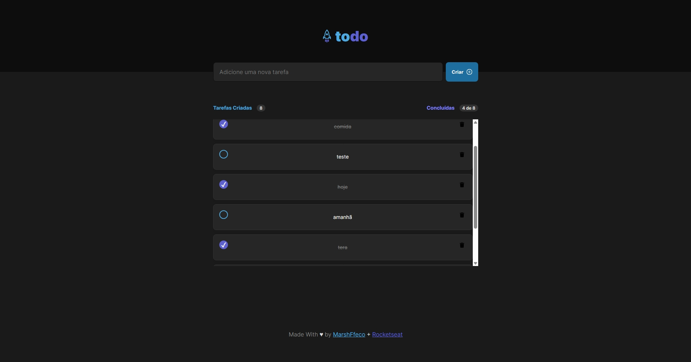
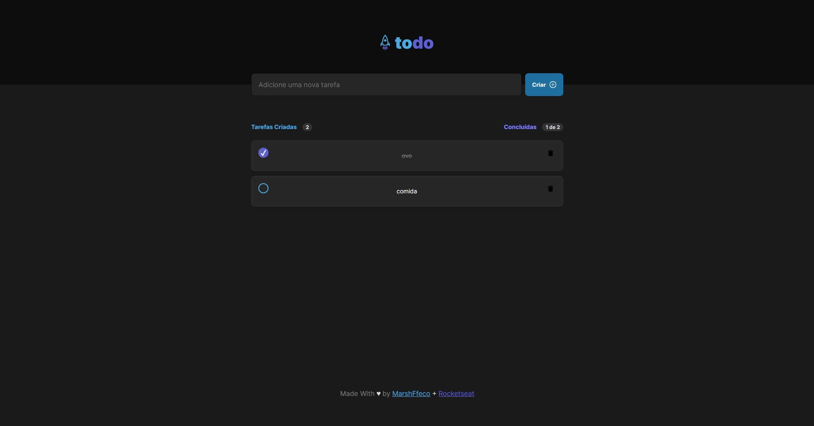
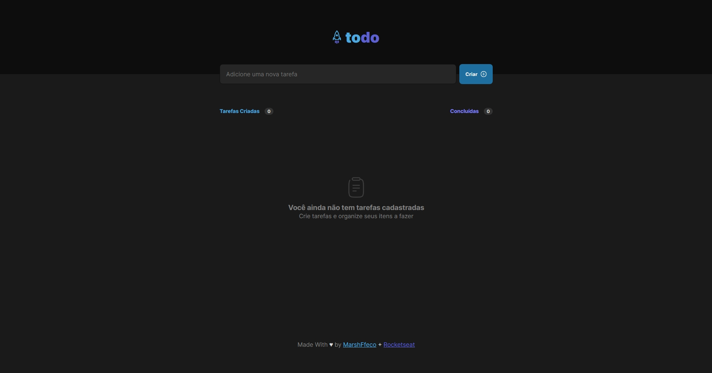

# Desafio Rocketseat 01 - React
Nesse desafio você vai reforçar os conceitos mais importantes do ReactJS e aprender ainda mais conceitos que serão utilizados em todas as aplicações que você for desenvolver no futuro.


## Instalação

Instale as dependências npm

```bash
  npm i
```
    
## Screenshots






## Autor

- [@MarshFfeco](https://github.com/MarshFfeco)

